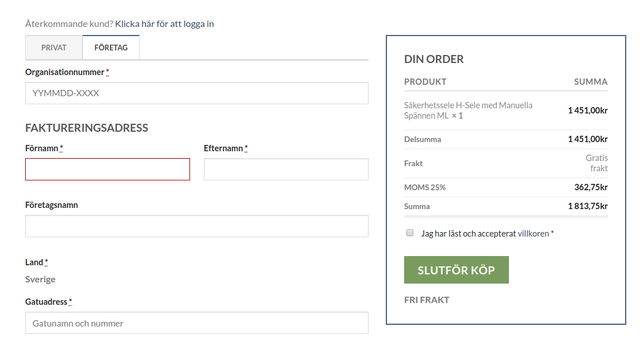

# Customization of b2b&b2c checkout
This plugin was developed for the sake of modifying and extending the default functionality of Klarna Checkout WooCommerce. The main task included the following features:

- switch between the user types: "Organization" and "Individual";
- customization of processing the inputs of organization numbers.

